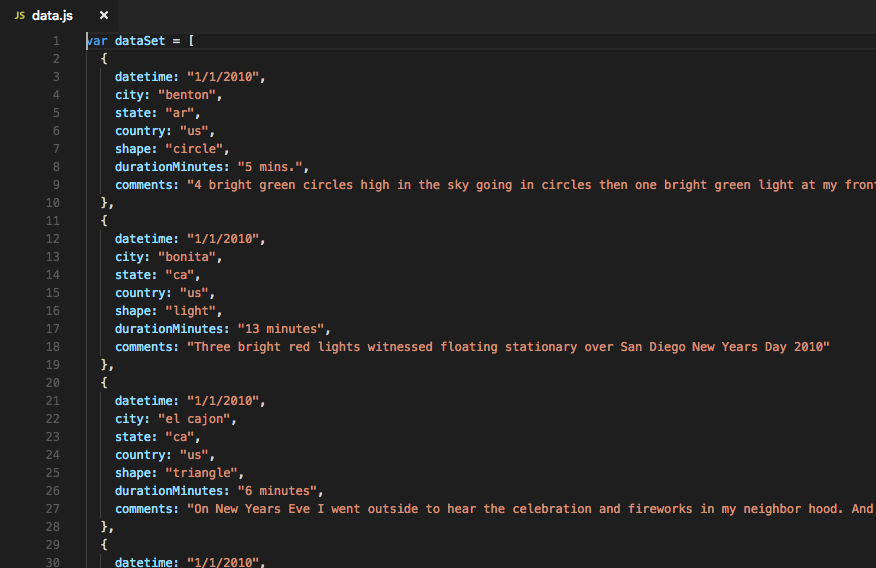
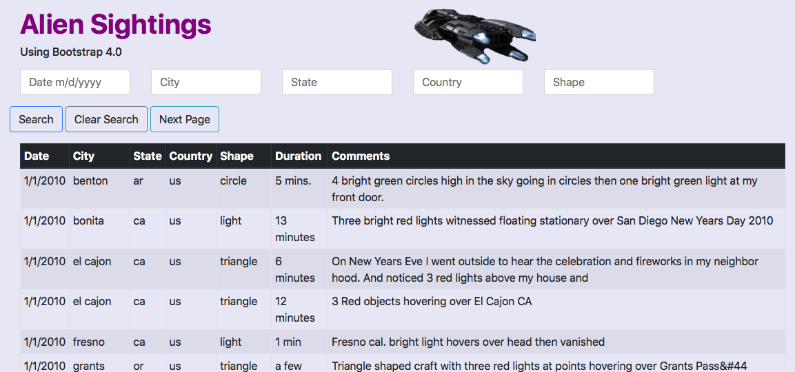

# Aliens-R-Us

### Background

WAKE UP SHEEPLE! The extra-terrestrial menace has come to Earth and we here at Aliens-R-Us have collected all of the eye-witness reports we could to prove it! All we need to do now is put this information online for the world to see and then the matter will finally be put to rest.

There is just one tiny problem though… The collection is too large to search through manually or in good ol' excel.

The purpose of this project was to create a searchable web tool using: JavaScript, HTML, CSS and Bootstrap.  The data was downloaded in a flat file format, and I used Python to convert it into a JavaScript object, I could then embed into the website as a searchable table.

The site is completely interactive and results update automatically by selecting a different search field

This project can be found on my website:

https://www.juliobernal.com/alien-sightings

